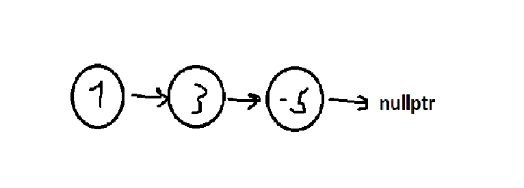
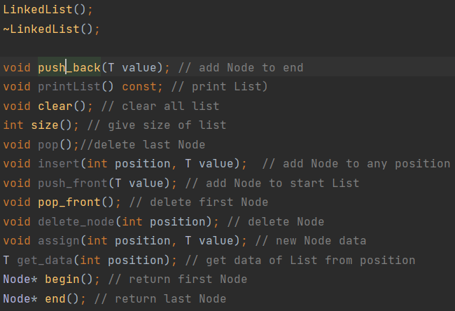
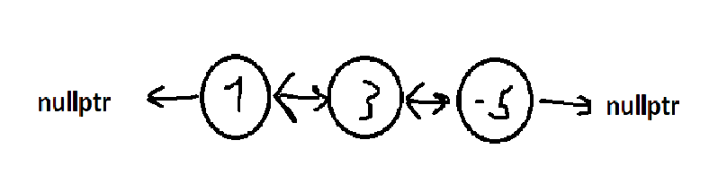
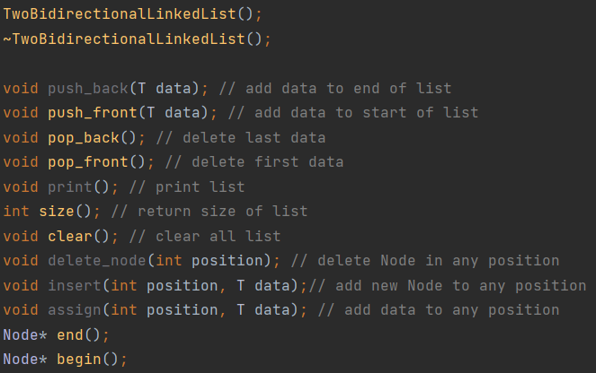
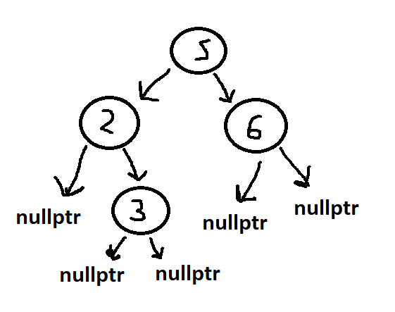
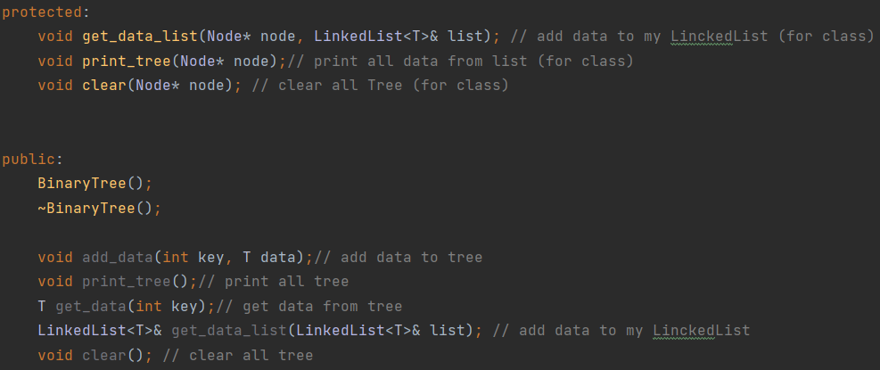

# Graphs
In general, I decided to remember (really learn) what I learned in my first year: Lists! I also looked at the code written 2 years ago - the implementation of a binary tree, and was shocked at how bad everything was, and now, Updated version!

This project has three data structures: 
Singly linked list;
doubly linked list;
Binary tree.

 Each of the entities is template and can work with 5 data types:
int;
double;
string;
char;
bool;

LinkedList(Singly linked list):

Methods:

TwoBidirectionalLinkedList(Doubly linked list;):

Methods:

BinaryTree(Binary tree):

Methods:

